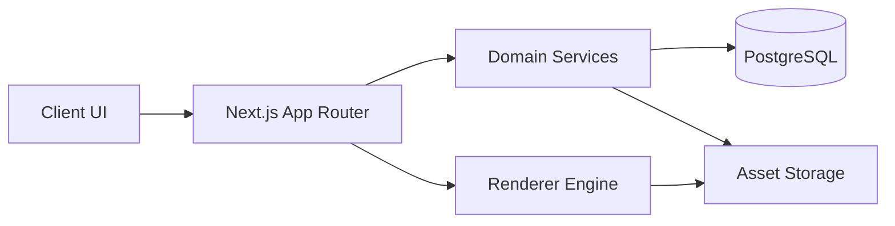

# Chapter 3 — System Architecture

## Architectural style

WheelVision follows a layered SaaS architecture with a clear split between presentation, domain services, data access, and infrastructure.

## Layers

- Presentation: Next.js app, React components, state-driven preview UI.
- Application: use cases for vehicles, wheels, tyres, quotes, and admin workflows.
- Domain: metadata validation, rendering rules, tenant policy, and quote logic.
- Infrastructure: Supabase, storage, edge deployment, observability.

## Key principles

- The rendering engine consumes metadata and assets and does not depend on hardcoded vehicle rules.
- The API layer is the single integration boundary for UI and admin workflows.
- All writes are validated before persistence.
