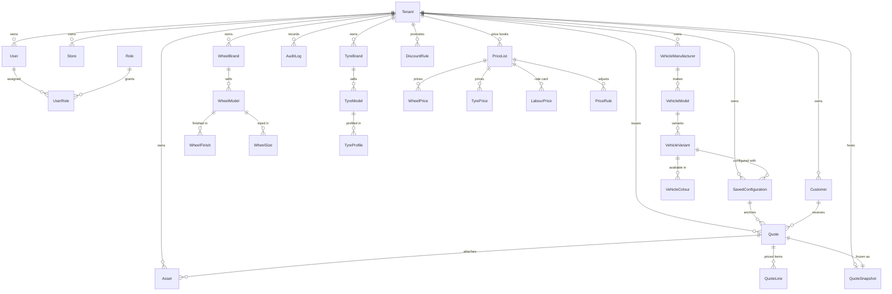

# Entity-Relationship Diagram

PostgreSQL schema (Prisma, `prisma/schema.prisma`). Every domain table is
tenant-scoped (`tenantId` FK → `Tenant`, cascade) and soft-delete aware
(`deletedAt`) except the quote-content tables, which are immutable.

## Sprint 8 additions (migration `20260731150000_quote_domain`)

### Tenant

| Column | Notes |
| --------------- | ----------------------------------------------------------------- |
| `quoteSequence` | `Int @default(0)` — the atomic quote-number counter (see quote-domain.md) |

### PriceList — a named price book per tenant

| Field | Notes |
| ----------- | ------------------------------------------------------------------- |
| `kind`      | `RETAIL` (default) · `WHOLESALE` · `DEALER` — future resolver seam  |
| `currency`  | ISO-4217, default `ZAR` — gates the whole quote computation         |
| `isDefault` | resolver picks the active default first                             |
| unique      | `(tenantId, name)`                                                  |

### PriceRule — price-list line adjustments

`category` (`WHEEL|TYRE|LABOUR|ACCESSORY|PACKAGE`), `adjustmentType`
(`PERCENT` basis points xor `FIXED` cents), optional `brand` scope,
`priority` (stable ordering), `active`. Indexed `(tenantId, priceListId,
active)`.

### WheelPrice / TyrePrice — the catalog price book

`amountCents` per `wheelModelId` (+ optional `wheelSizeId` qualifier) /
`tyreModelId` (+ optional `tyreProfileId` qualifier). **Specificity rule:**
the qualified row wins over the model-wide (`null` qualifier) row. Indexed
`(tenantId, priceListId, modelId)`.

### LabourPrice — the service rate card

`serviceType` (`FITMENT|BALANCING|ALIGNMENT`) × `unit`
(`PER_WHEEL|PER_VEHICLE`) → `amountCents`. Unique
`(priceListId, serviceType, unit)`.

### DiscountRule — order-level promotions

`kind` (`PERCENT` xor `FIXED`), optional `category` scope, `priority`,
`active`, validity window `validFrom`/`validTo`. Indexed `(tenantId, active)`.

### Quote — extended additively

| New column | Notes |
| ---------------- | --------------------------------------------------------------------- |
| `quoteNumber`    | `WV-<year>-<seq>`; unique with tenantId `(tenantId, quoteNumber)`     |
| `consultantName` | free-text attribution from the compose dialog                         |
| `currency`       | default `ZAR`                                                         |
| `subtotalCents` / `discountCents` / `vatBasisPoints` / `vatCents` | integer money columns |
| `validUntil`     | issue + 30 days (`QUOTE_VALIDITY_DAYS`)                               |
| `archivedAt`     | set by the only lifecycle write (ISSUED → ARCHIVED)                   |

Legacy `totalAmount Decimal(10,2)` remains and is mirrored
(`totalCents/100`) to keep pre-Sprint-8 readers working. Indexed
`(tenantId, status)`.

### QuoteLine — priced items (immutable)

`category`, `description`, `quantity`, `unitAmountCents`, `totalCents`,
`sortOrder` (presentation order), `metadata` Json (finish/size/profile
ids). **Ids are pre-generated by the service** so rows and the snapshot's
`pricing.lines` are twins. No `deletedAt`/`updatedAt` — they never change.

### QuoteSnapshot — the frozen offer (1:1 with Quote)

`quoteId @unique`, `version @default(1)`, `payload Json` — the full
`QuoteSnapshotPayload` (parties, configuration, vehicle/wheel/tyre detail,
render metadata, asset references, pricing incl. tax strategy, totals,
timestamps). See [quote domain](../quotes/quote-domain.md).

## Invariants enforced by the schema

- Quote numbers never collide: `@@unique([tenantId, quoteNumber])` +
  tenant-owned monotonic counter.
- One snapshot per quote: `QuoteSnapshot.quoteId @unique` (+ `onDelete:
  Cascade` via `Quote`).
- All reads tenant-scoped: every domain row carries `tenantId` and service
  queries always include it.
- Additive only: Sprint 8 introduces zero destructive changes — new tables,
  new nullable/defaulted columns, one new unique index.
