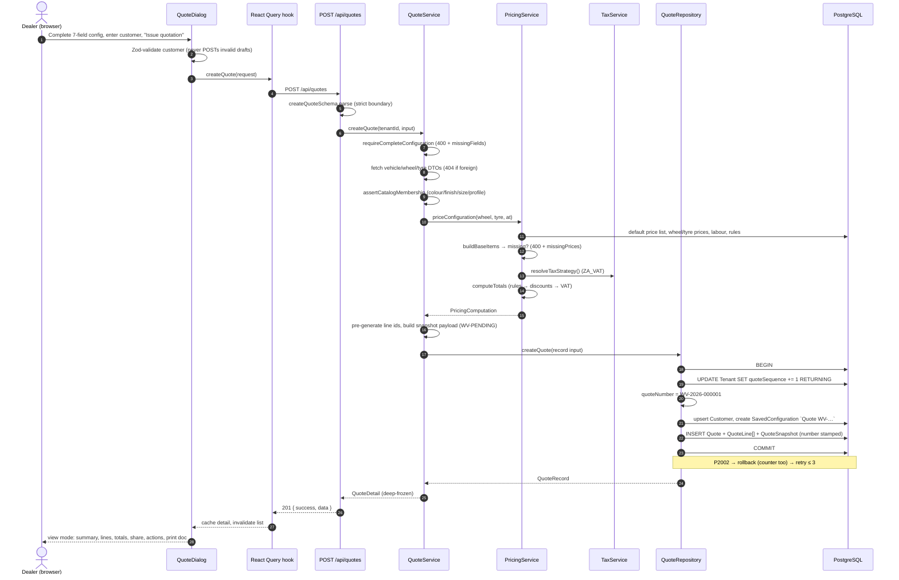
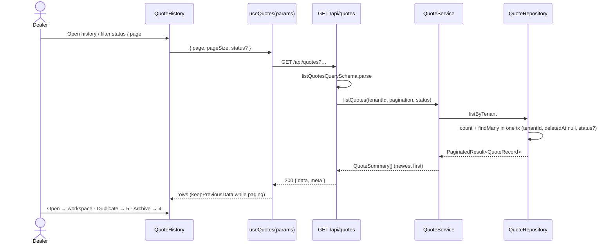
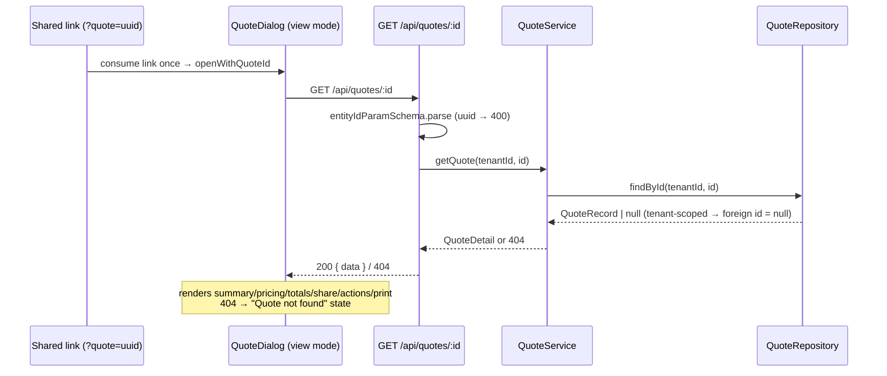
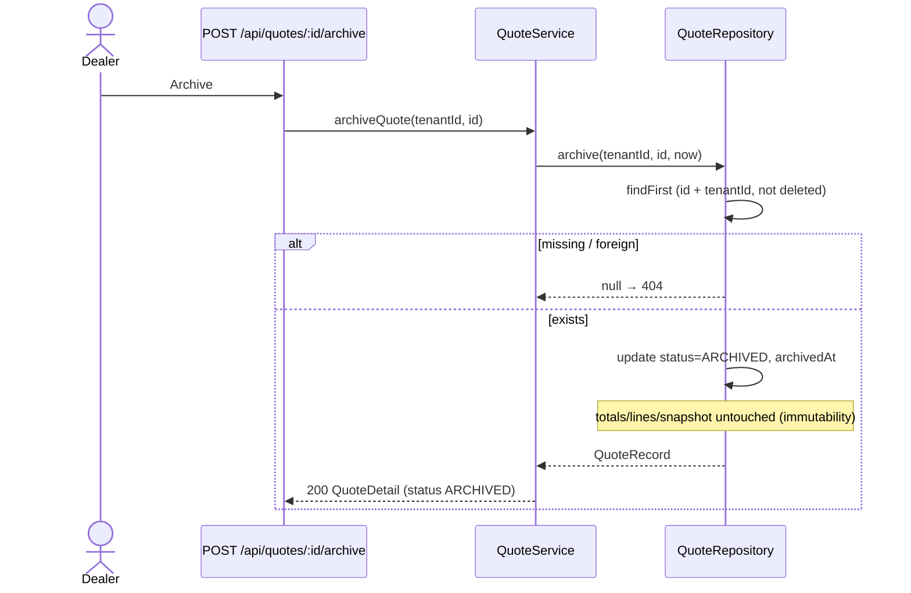

# Quote Flows — Sequence Diagrams

The four server flows of the quote engine plus the client share-link flow.
All diagrams render as [Mermaid](https://mermaid.js.org).

## 1. Issue a quotation (`POST /api/quotes`)



## 2. Quote history (`GET /api/quotes`)



## 3. Read a quote (`GET /api/quotes/:id`)



## 4. Archive (`POST /api/quotes/:id/archive`)



## 5. Duplicate (`POST /api/quotes/:id/duplicate`)

```mermaid
sequenceDiagram
    actor D as Dealer
    participant API as POST /api/quotes/:id/duplicate
    participant S as QuoteService
    participant P as PricingService
    participant R as QuoteRepository

    D->>API: Duplicate
    API->>S: duplicateQuote(tenantId, id)
    S->>R: findById(tenantId, id)
    R-->>S: QuoteRecord | null → (404)
    S->>S: readSnapshot (null/corrupt → 400)
    S->>S: rebuild request from snapshot (config + parties)
    S->>P: priceConfiguration(…, now)  ← today's price book
    P-->>S: fresh PricingComputation
    S->>R: createQuote (new number, new id)
    R-->>S: QuoteRecord
    S-->>API: 201 QuoteDetail (fresh WV number)
    Note over S,R: source quote untouched; history never rewritten
```
